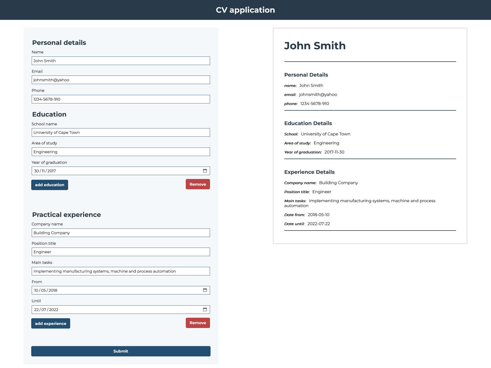
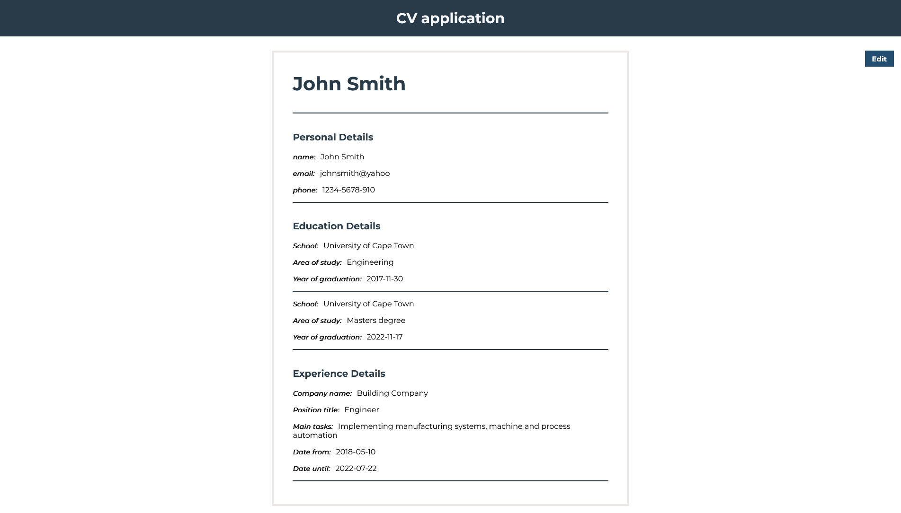

# Project description

This is a project for the Odin Project to create a cv-builder application.
The goal is to get more familiar with React basic concepts such as state.

## Screenshots

### Features

Users can:
- add their information which is displayed in a preview CV
- add extra education and experience sections
- submit their information to view only the CV
- click the edit button to bring up the form and edit their information

### What I learned

- Treating JS objects as read-only and not to mutate them but replace them.
- How to update nested objects 

I really enjoyed learning about using state in React. The [React](https://react.dev/learn) docs where extremely helpful, especially the articles about updating objects and arrays.
I want to keep learning about using state correctly and how to structure my components in React.
